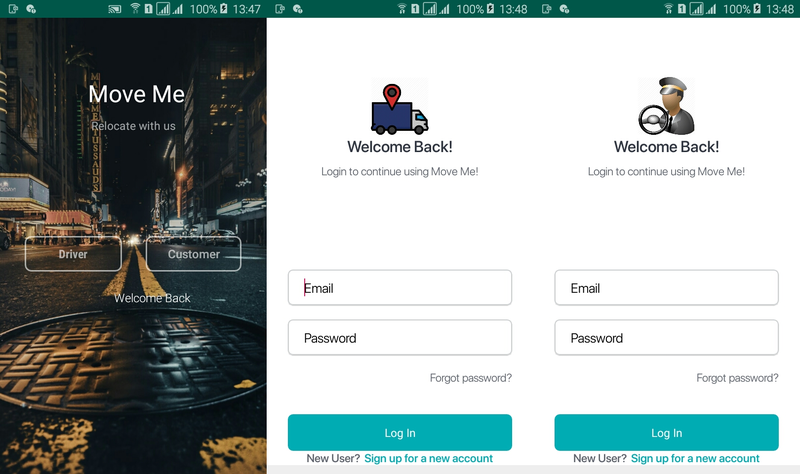

# Move Me
#### July 18th 2019
#### By **peteHack**


## Description

```bash

Move me is a mobile application that is built on Android framework to facilitate the process of delivery and relocation process of businesses and household items.

```
## Technologies Used
[](https://forthebadge.com)


## Installation
* `https://gitlab.com/peter-wachira/MoveMe-Android` this repository
* `cd MoveMe-Android`

## Launching the Application

```bash
1.Launch the project in Android Studio

```


## Contact Details and Documentation

```bash

You can reach me via my personal email pwachira900@gmail.com

```


## License

- This project is licensed under the MIT Open Source license Copyright (c) 2019. [LICENCE](https://gitlab.com/peter-wachira/MoveMe-Android/-/blob/troubleshootDevelopment/LICENSE)

[](https://forthebadge.com)

[](https://forthebadge.com)
